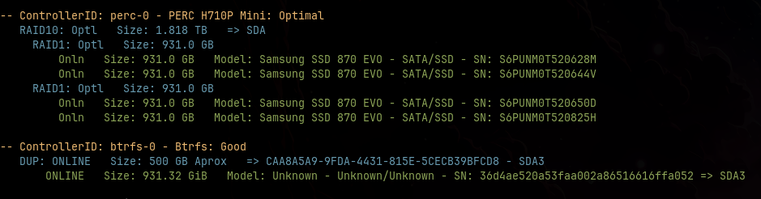
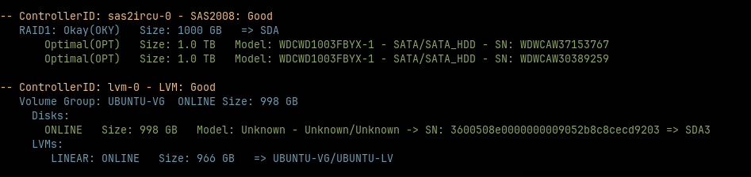
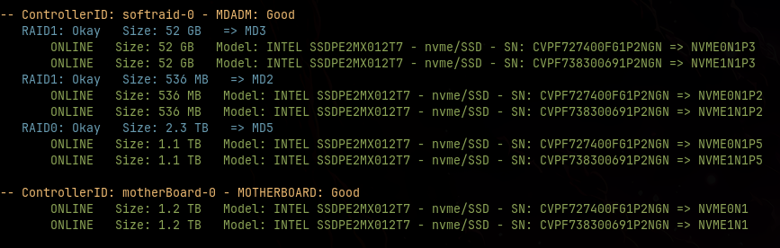
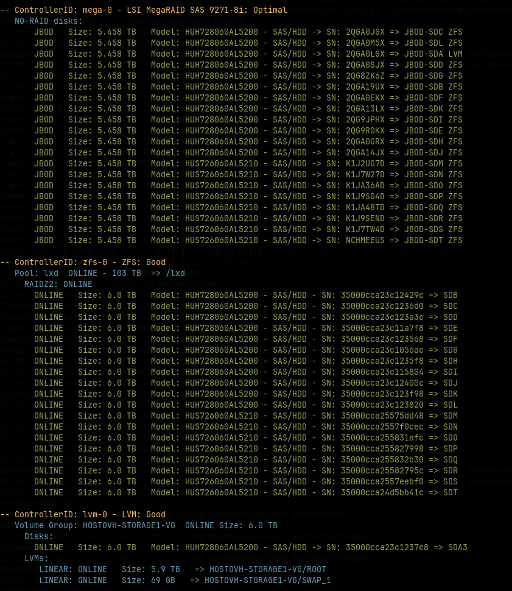
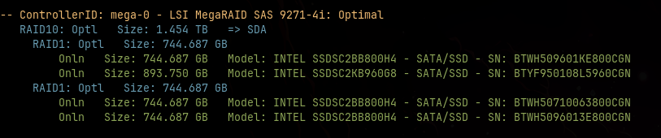
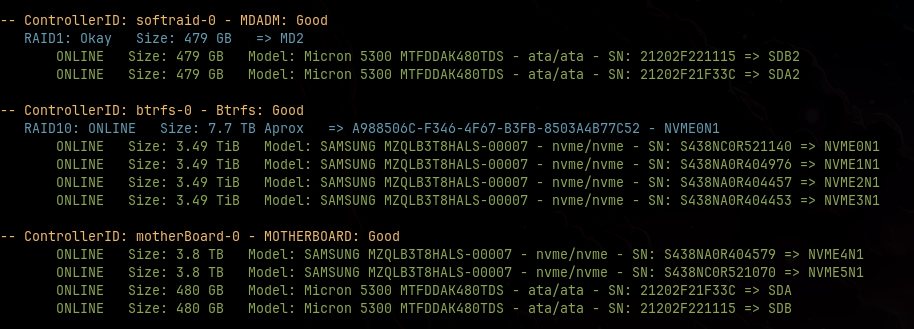
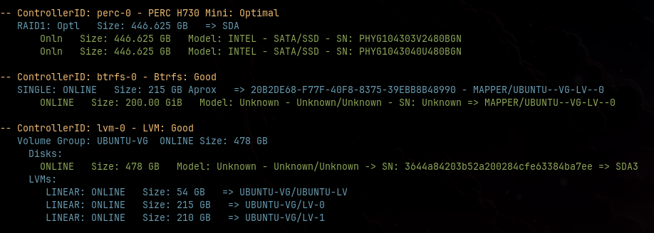
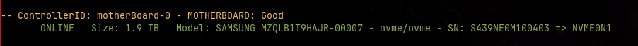

#### hardwareAnalyzer: Linux Raid/disks configuration detection tool with auto contained disk tools.
MegaRaid/PERC/SAS2IRCU/ADAPTEC/SoftRAID/ZFS/Btrfs/LVM/Disks Linux support.

## Table of contents
- [Initial setup](#initial-setup)
- [Screenshots]()
- [CLI parameters](#cli-parameters)

---

## Initial setup:

```
git clone https://github.com/ARPABoy/hardwareAnalyzer.git
go mod tidy
go build
./hardwareAnalyzer
```

## Screenshots:

|                                  |                                        |
|----------------------------------|----------------------------------------|
|          |        |
|  |                  |
|  |              |
|            |  |


---

## CLI parameters

You can get available command line options via:
```
go run hardwareAnalyzer.go -h
```

Also you can check unitary tests running:
```
go test ./...
go test ./... -coverprofile=coverage.out && go tool cover -func=coverage.out
```

---

Software provided by kr0m(ARPABoy): https://alfaexploit.com
